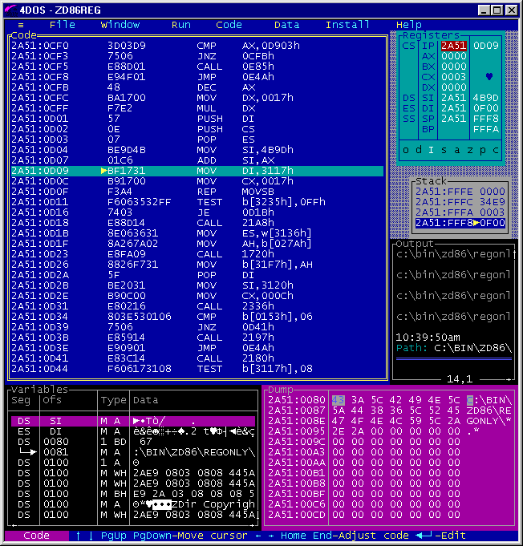
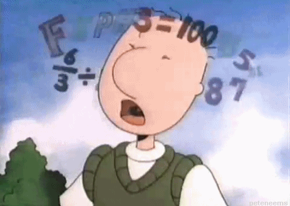

# [fit] I. Intro to Programming

---

## SWBAT (Students Will Be Able To)

- Grasp the basic concepts of what programming is
- Understand what Javascript is used for
- Grasp and practice the basics of Javascript syntax
- Complete an assessment and extra credit assignment

---

## Basics of programming

- We will be covering in this section a very high level overview of what programming is
- From here on out, any terminology will be **bolded**
- Code will be displayed in `monospace`.

---

## Code

- **Source Code** or just **Code**, is a set of special instructions a computer reads in order to know what tasks to perform
- Usually, this code is saved in a file, although for javascript we can also type it into the browser for either practice or debugging purposes (more on this later)
- **Computer Language** or **Syntax**, are the rules for the valid format of this language

---

This is English.

lkjoer/I#(?)

that is not --^

---

`var student = 'Tom';` is valid Javascript

`varr student 'Tom';` is not and will result in the computer throwing it's hands up in the air

---

## Expressions

- An **Expression** is any reference to a value, or a set of value(s) and/or value(s) combined with operators
- For example:
  - `a = b * 2;`
  - `a` and `b` are called **variable expression**
      - means retrieve it's current value

---

## Expressions

- For example:
  - `a = b * 2;`
  - `2` is a **literal value expression**
      - it is named as such because it is not stored inside of a variable
  - `b * 2` is an **arithmetic expression**
  - `a = b * 2` is an **assignment expression**

---

## Statements

- In a computer language, a group of words, numbers, and operators that performs a specific task is called a **Statement**
- It is a collection of expressions
- Example
  - `a = 4 * 2;`
  - `a` and `b` are called a **variable**
      - boxes that hold values
  - `=` and `*` are operators
      - they perform actions
- Most statements in Javascript conclude with a semicolon

---

## Statements

- Example
  - `a = 4 * 2;`
  - `=` and `*` are operators
      - they perform actions
- Most statements in Javascript conclude with a semicolon

---

## Executing a Program

- So how does the computer interpret all this?
- The statements in the above examples are helpful for us to read, but the computer can't actually read that as written
- To be "executed" a special utility on the computer is used to translate the code into **machine language** the computer can understand
    - One such utility is an "compiler" that translates Javascript into machine-readable code

---



---

> Javascript is the duct tape of the internet
-- Charlie Campbell

---

# [fit] II. Javascript

---

Let's try a bit of code before we continue

- Open your favorite browser (not IE)
- Open the console on any page
    - either in "settings" or try "cmd/ctrl + opt/alt + j"

---

## Javascript

- The history of [Javascript](https://embedwistia-a.akamaihd.net/deliveries/02b2a82f133a6d2c55210097cfb6e0daa04cf380/file.mp4)
- How HTML, CSS, and Javascript work together
- How you add it to the browser
    - take a look at adding-js.html

---

## Syntax
### Comments

- There are two ways to declare comments

```
// This is an in-line comment

/* This is a multi-line
   comment */
```

---

## Syntax
### Variables

- **Variables** allow computers to store and manipulate data dynamically.  When you create a variable you are essentially creating a label for the computer to use as an identifier for that data point.
`var userName`

*Instructions*
Initialize a variable.

---

## Syntax
### Assignment Operator

- You can also store values to a variable by with the **assignment** operator `=`
- Everything to the right of the `=` is evaluated first

`var userName = 'Micky';`
`var x = 12 + 1;`
`var isTrue = true;`

*Instructions*
Create a variable that holds your first name.

---

- About naming things....
  - Be wary of reserved keywords
  - Pick a name that makes sense

---

## Syntax
### Warning!


- You can override variables  
- This is know as reassigning or compound assignment

```
var a = 12;
a = 16;
// can also reassign to it's original value
a = a + 12;
```


---

## Syntax
### Value Types

- Let's talk about Javascript's 6 different value types
  - number
  - string
  - null
  - undefined
  - boolean
  - object

---

## Syntax
### Value Types

-  **Value Types** are values that can be assigned to a variable

```
var a = 12 // number
var myDog = 'Osito' // string
var isTrue = true // boolean
var isFalse = false // boolean
var no = null
var who = undefined

```

---

## Syntax
### Arithmetic

- Addition
`var adding = 5 + 10;`
`console.log(adding) // 15`

- `-` subtract
- `*` multiply
- `/` divide

---

*Instructions*

- Practice adding, subtracting, and dividing numbers.

---

## Syntax
### Arithmetic

- You can also **increment** numbers with the `++` operator

```
var a = 12;
a++; //13
a = a + 1; //14
```

- How would you **decrement** a number?

---

*Instructions*

- Practice incrementing and decrementing a number

---

## Syntax
### Arithmetic

- We can store decimal numbers in variables too. Decimal numbers are sometimes referred to as **floating point** numbers or floats.

`var myDecimal = 7.9;`

---

## Syntax
### Arithmetic

- The **remainder** operator `%` gives the remainder of the division of two numbers.

```
var x = 12 % 6;
console.log(x) // 0
var y = 10 % 4;
console.log(y) // 2
```
- In mathematics, a number can be checked even or odd by checking the remainder of the division of the number by 2.

---

*Instructions*

- Check whether `19` is odd
- Check whether `12` is even

---

## Syntax
### Compound Assignment

- Sometimes you'll need to use assignments to modify the contents of a variable
`var myVar = 1;`
`myVar = myVar + 5; //6 `
- We can do this in one step
`myVar += 5; //6`

---

*Instructions*

- Initialize a variable with a numerical value
- Use compound assignment to add any number to the original value

---
## Syntax
### Compound Assignment

- We can do the same with all other forms of operators

*Instructions*

- Do the same as the previous exercise but for `-`, `*`, `/`.

---

## Quiz!


- Every so often I will present you with an exercise to test what we've learned so far
- You will have about 5 to 20 mins depending on the difficulty of the quiz
- Please try these exercises for at least 5 to 10 mins before asking for help

---

- The algorithm to convert Celsius to Fahrenheit:
  - `fahrenheit` equals `celsius` times `9/5` plus `32`.
- Plug the `function` on the next page into our online repl and modify the code in-between the lines.

---

```
function convertToF(celsius) {
  var fahrenheit;
  // Only change code below this line

  // Only change code above this line
  return fahrenheit;
}

convertToF(30);

```

---

## Syntax
### Strings

`var myName = "Robert";`
- `myName` is a **string literal**
- it is a series of 0 or more characters inclosed in either single or double quotes
*Instructions*
- create two variables that hold your first and last name

---

## Syntax
### Strings

- When you are defining a string you must start and end with a single or double quote. What happens when you need a literal quote: " or ' inside of your string?

- In JavaScript, you can escape a quote from considering it as an end of string quote by placing a backslash `\` in front of the quote.


---

## Syntax
### Strings

```
var sampleStr = "Jim said, \"I could sure go for a cold one right now\".";
```
*Instructions*

- Use backslashes to assign a string to a variable so that if you were to print it to the console, you would see:

I am a "double quoted" string inside "double quotes".

---

## Syntax
### Strings

- You can also use single quotes inside a string literal
`var myStr = "Mark yelled 'Hello world' at the top of his lungs.";`

*Instructions*

- Change the provided string from double to single quotes and remove the escaping.

---

`var myStr = "<a href=\"http://www.example.com\" target=\"_blank\">Link</a>";`

---

## Answer

`var myStr = '<a href="http://www.example.com" target="_blank">Link</a>';`

---

## Syntax
### Strings

- **Concatenation** is when you add strings together
```
var twoGether = "I am first" + "I am second";
```
*Instructions*
- create two variables (firstName and lastName)
- add them together in a third variable (fullName) to create your name

---

## Syntax
### Strings

- You can also use the compound assignment operator to concatenate strings

*Instructions*
- same exercise as before, but with the compound assignment operator.

---

## Syntax
### Strings

- You can combine strings and variables
*Instructions*
- Set a variable to a string equal to your name and build `myMsg` with your variable between the strings
- "Hi!  My name is  " + " and I am learning Javascript"!"

---

```
var myName = "Robert Aguilera";
var myStr = "Hi!  My name is " + myName + " and I am learning Javascript!";
```

---
## Syntax
### Strings

var someAdj = "cray cray";
var myStr = "Learning to code is ";

*Instructions*

- concat those two strings using compound assignment operators

---

## Syntax
### Strings

- Sometimes you'll need to know the length of a string
- Here you can use the **property** called `length`
  - This can be used on any strings to find the number of characters in that string

```
var x = 'four';
console.log(x.length); // 4
```

---

## Syntax
### Strings

- When you need to access a specific character in a string
  - `var myStr = 'Hello';`
  - You need to access it's **index** aka the position in which it sits
  - This is a numerical value  

---

## Syntax
### Strings (Index)

- We can access this position using *Bracket Notation*
```
var firstName = "Robert";
console.log(firstName[0]);
```

---

- Javascript and many other languages use what's called *Zero based* indexing
  - meaning they don't start counting at 1, but at 0


*Instructions*

Use bracket notation to find the first character in the firstName variable and assign it to firstLetterOfFirstName.
`var firstName = 'Jimmy';`

---

## Syntax
### Strings

- Often you'll hear whether something is *mutable* or *immutable**
- Strings are immutable
  - can't change em once they're created

---

## Strings

```
var myStr = "Ricky";
myStr[0] = "J";
console.log(myStr);
```

*Instructions*
- Fix this variable
`var misSpelt = 'Brokan';`

---

## Syntax
### Strings

- You can also assign single letters to other variables using bracket notation

*Instructions*
 - Set the third letter of `var myStr = 'Donald';` to a variable called `var thirdLetter;`

---

## Syntax
### Strings

- Let's say you have a word which is dynamic (you don't know what it is) and you need to access the last letter
`var firstName = 'Robbie';`
`var last = firstName[firstName.length - 1];`

---

## Pop Quiz!


- We will now use our knowledge of strings to build a "Mad Libs" style word game.

- You will need to use string operators to build a new string, result, using the provided variables: myNoun, myAdjective, myVerb, and myAdverb.

- The output should be a complete sentence.

---

```
function wordBlanks(myNoun, myAdjective, myVerb, myAdverb) {
  var result = "";
  // Your code below this line

  // Your code above this line
  return result;
}

wordBlanks("dog", "big", "ran", "quickly");
```

---

## Syntax
### Arrays

- With JavaScript **array** variables, we can store several pieces of data in one place.
- You start an array declaration with an opening square bracket, end it with a closing square bracket, and put a comma between each entry, like this:
`var sandwich = ["peanut butter", "jelly", "bread"]`

---

## Syntax
### Arrays

- arrays can contain any kind of value

*Instructions*
Create an array and try to cram as many different types of values in it

---

## Syntax
### Arrays

- You can also nest arrays within other arrays, like this:
`[["Bulls", 23], ["White Sox", 45]]`
- This is also called a Multi-dimensional Array.

*Instructions*
Create a nested array

---

## Syntax
### Arrays

- We can access the data inside arrays using indexes

- Array indexes are written in the same bracket notation that strings use, except that instead of specifying a character, they are specifying an entry in the array

- Watch the zero based indexing

---

```
var array = [1,2,3];
array[0]; // equals 1
var data = array[1];  // equals 2
```
*Instructions*

- Create a variable called myData and set it to equal the first value of myArray using bracket notation.
`var myArray = [1,2,3,4]`

---

## Syntax
### Arrays

- Unlike strings, the entries of arrays are mutable and can be changed freely.

```
var ourArray = [3,2,1];
ourArray[0] = 1; // equals [1,2,1]
```
*Instructions*
Modify the data stored at index 0 of ourArray to a value of 9.

---

## Syntax
### Arrays

- One way to think of a multi-dimensional array, is as an array of arrays. When you use brackets to access your array, the first set of brackets refers to the entries in the outer-most (the first level) array, and each additional pair of brackets refers to the next level of entries inside.

---

## Syntax
### Arrays

```
var arr = [
    [1,2,3],
    [4,5,6],
    [7,8,9],
    [[10,11,12], 13, 14]
];
arr[3]; // equals [[10,11,12], 13, 14]
arr[3][0]; // equals [10,11,12]
arr[3][0][1]; // equals 11
```
---

*Instructions*

```
var myArray = [[1,2,3], [4,5,6], [7,8,9], [[10,11,12], 13, 14]];

//Using bracket notation select an element from myArray such that myData is equal to 8.

var myData;
```

---

```
var arr = [
    ['hello'],
    ['class'],
    ['how'],
    ['are'],
    ['you',['!']]
];
```
*Instructions*
- set the 'o' in 'hello' to a variable
- set the last 'l' in 'class' to a variable
- set the '!' to a variable

---

## Syntax
### Arrays

- Now we are going to manipulate arrays
- An easy way to append data to the end of an array is via the push() function
- `.push()` takes one or more parameters and "pushes" them onto the end of the array

---

## Syntax
### Arrays

```
var arr = [1,2,3];
arr.push(4);
// arr is now [1,2,3,4]

```

---

## Syntax
### Arrays

*Instructions*
- push `['dogs', 3]` onto the end of `myArray`;
```
var myArray = [["John", 23], ["cat", 2]];
```

---

## Syntax
### Arrays

- Another way to change the data in an array is with the .pop() function.

- `.pop()` is used to "pop" a value off of the end of an array. We can store this "popped off" value by assigning it to a variable.

- Any type of entry can be "popped" off of an array - numbers, strings, even nested arrays.

---

## Syntax
### Arrays

`var oneDown = [1, 4, 6].pop();`

- the variable oneDown now holds the value 6 and the array becomes [1, 4].

---

## Syntax
### Arrays

*Instructions*

- pop off the last item from `myArray`

`var myArray = [["John", 23], ["cat", 2]];`

---

## Syntax
### Arrays

- pop() always removes the last element of an array. What if you want to remove the first?

- That's where `.shift()` comes in. It works just like .pop(), except it removes the first element instead of the last.

---

## Syntax
### Arrays

*Instructions*

- shift off the first item from `myArray`

`var myArray = [["John", 23], ["cat", 2]];`

---

## Syntax
### Arrays

- Not only can you shift elements off of the beginning of an array, you can also unshift elements to the beginning of an array i.e. add elements in front of the array.

- `.unshift()` works exactly like .push(), but instead of adding the element at the end of the array, unshift() adds the element at the beginning of the array.

---

## Syntax
### Arrays

*Instructions*

- Add ["Paul",35] to the beginning of the myArray variable using unshift().

`var myArray = [["John", 23], ["cat", 2]];`

---

## Time to work that array knowledge


- Create a shopping list in the variable myList
  - The list should be a multi-dimensional array containing several sub-arrays
- The first element in each sub-array should contain a string with the name of the item
  - The second element should be a number representing the quantity
  - At least 5 sub-arrays

---

## Syntax
### Blocks

- When we need to group a series of statements together we use what's called a **block**

```
var amount = 99;
{
  amount *= 2;
  console.log(amount);
}
```

---

## Syntax
### Blocks

- That kind of standalone block is valid, but not commonly seen in Javascript, rather, it is used with what we call **control statements** which are statements that provide some kind of logic

---

## Syntax
### Conditionals

- One type of control statements are **conditionals** aka decisions
- For example, we have the `if` block

---

```
var bank_balance = 100;

if (bank_balance < 10) {
  console.log('No can do chief!');
}
```

- Here we are checking if `bank_balance` is less than `10` log a message
- If that conditional evaluates to true, then the code inside that block will run
- Otherwise it gets skipped

---

- We can also attach an `else` or `else if` statement to catch other logic possibilities
- Why we do this is...


---

```
if (bank_balance == 1) {
  console.log('No can do chief!');
} else if (bank_balance == 0) {
  console.log('Can I interest you in loan?');
} else {
  console.log('Not sure what you got going on there buddy.');
}
```

---

- We can also use what's called a switch statement

```
switch (bank_balance) {
  case 1:
    console.log('No can do chief!');
    break;
  case 0:
    console.log('Can I interest you in loan?');
    break;
  default:
    console.log('Not sure what you got going on there buddy.');
    break;
}
```

---

## Syntax
### Equality Operators

- There are many **Comparison Operators** in JavaScript
  - Their job is to compare two values and kick back a boolean of either true or false
  - Most basic is `==`

---

```
var bal = 12;
if (bal == 12) {
  console.log('Hi');
}
```

---

## Syntax
### Equality Operators

- Strict equality (===) is the counterpart to the equality operator (==)
  - Unlike the equality operator, strict equality tests both the data type and value of the compared elements.

```
3 === 3   // true
3 === '3' // false
```

---

## Syntax
### Equality Operators

- The inequality operator (!=) is the opposite of the equality operator
  - It means "Not Equal" and returns false where equality would return true and vice versa
  - Like the equality operator, the inequality operator will convert data types of values while comparing

---

```
1 != 2      // true
1 != "1"    // false
1 != '1'    // false
1 != true   // false
0 != false  // false
```

---

## Syntax
### Equality Operators

- The strict inequality operator (!==) is the opposite of the strict equality operator
  - It means "Strictly Not Equal" and returns false where strict equality would return true and vice versa
  -   Strict inequality will not convert data types

---

```
3 !== 3   // false
3 !== '3' // true
4 !== 3   // true
```

---

## Homework

- Write a program that prints the numbers from 1 to 100. But for multiples of three print “Fizz” instead of the number and for the multiples of five print “Buzz”. For numbers which are multiples of both three and five print “FizzBuzz”.
